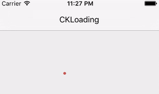
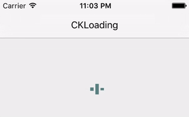
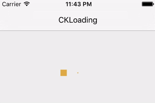

# CKLoadingView
🎤 Fully customized animatable iOS Loading view.

[](http://cocoadocs.org/docsets/CKLoadingView/)
[](http://opensource.org/licenses/MIT)

  
  
  

# Installation

## Pod
```ruby
pod 'CKLoadingView'
```
  
## Manually

Drag 'CKLoadingView.h' and 'CKLoadingView.m' to your project

# Usage

## Initialize with storyboard

### 1. Create a `CKLoadingView`
You can leverage storyboard to create a CKLoadingView, simply drag a `UIView` to the storybaord, and making that view subclass of `CKLoadingView`. And then make a IBOutlet to the controller:

```objc
@property (weak, nonatomic) IBOutlet CKLoadingView *circleLoadingView;
```

### 2. Setup the properties for `CKLoadingView`

All the properties are initialized with default value automatically, so you can let them unchange, and it will work with default behaviour.

For __simple usage case__, you can call `startAnimate` to begin animation:

```objc
[_circleLoadingView startAnimate];
```

For __advanced usage__, please refer the properties description below or the `Example` project:

Setup The signle loading item's width

```objc
_circleLoadingView.itemWidth = 20;
```

Setup The margin between two loading item

```objc
_circleLoadingView.itemMargin = _circleLoadingView.itemWidth * 0.3;
```

Setup The animation speed (unit: second)

```objc
_circleLoadingView.animationSpeed = 0.8;
```

Setup The loading item's shape

```objc
_circleLoadingView.loadingShape = CKLoadingShapeCircle;
``` 

Setup The loading items's color

```objc
_circleLoadingView.loadingColor = [UIColor colorWithRed:.8 green:.34 blue:.31 alpha:1];
```

Wait for 2.0 seconds when one group of animation finished

```objc
_circleLoadingView.animationStopWaitInterval = 2.0;
```

The succeeding loading item animation will be began with `_circleLoadingView.animationSpeed * 0.3` seconds after the proceeding loading item animation began.

```objc
_circleLoadingView.animationItemDelayInterval = _circleLoadingView.animationSpeed * 0.3;
```

The loading item's target alpha value when animation end. Please note the animation will be reverse back, so the alpha animation will be:  1.0 ----> 0.3 ---> 1.0

```objc
_circleLoadingView.animateToAlpha = 0.3;
```

Trigger loading view to start animation

```objc
[_circleLoadingView startAnimate];
```

Stop animation

```objc
[_circleLoadingView stopAnimate];
```

## Programmatically Initialize

```objc
@property (nonatomic) CKLoadingView *circleLoadingView;

_rectLoadingView = [[CKLoadingView alloc] initWithFrame:CGRectMake(0, 100, CGRectGetWidth([UIScreen mainScreen].bounds), 200)];
_rectLoadingView.loadingShape = CKLoadingShapeRectangle;
[self.view addSubview:_rectLoadingView];

// Trigger loading view to start animation
[_rectLoadingView startAnimate];

// Stop animation
[_rectLoadingView stopAnimate];
```
